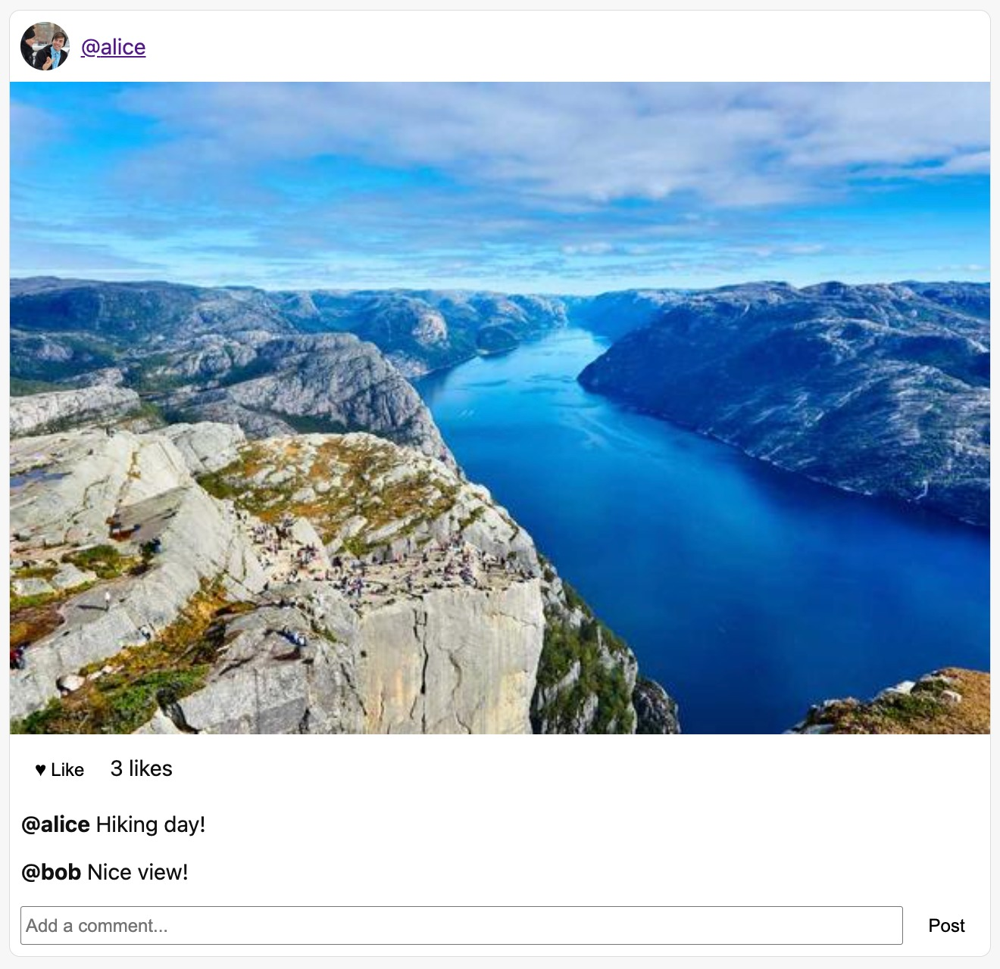
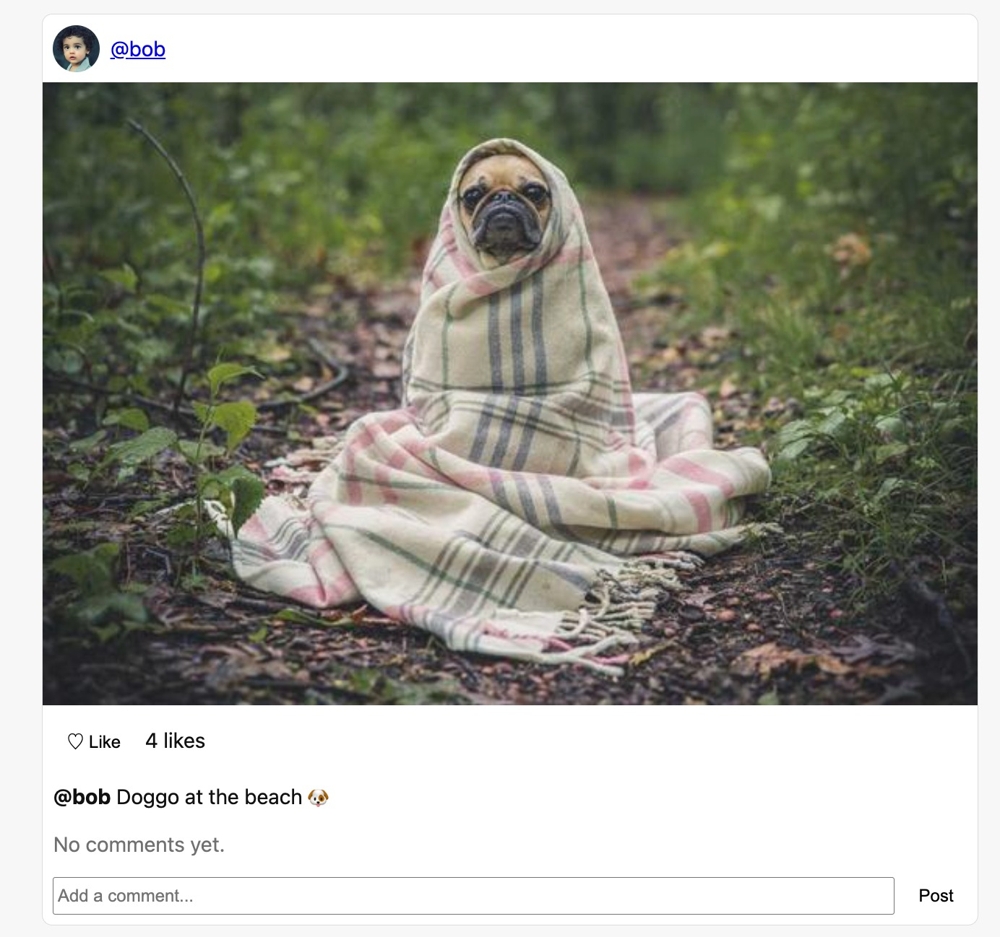
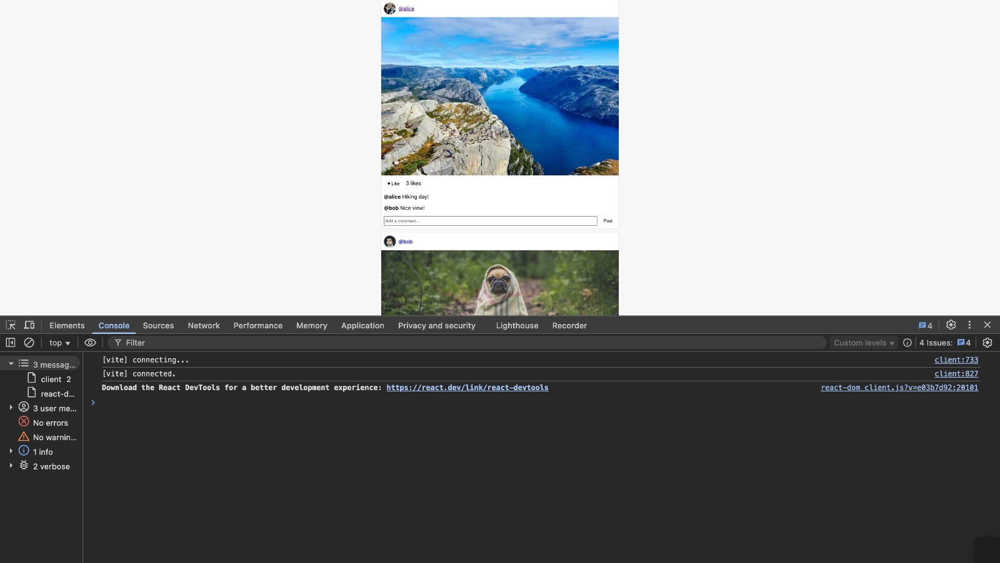
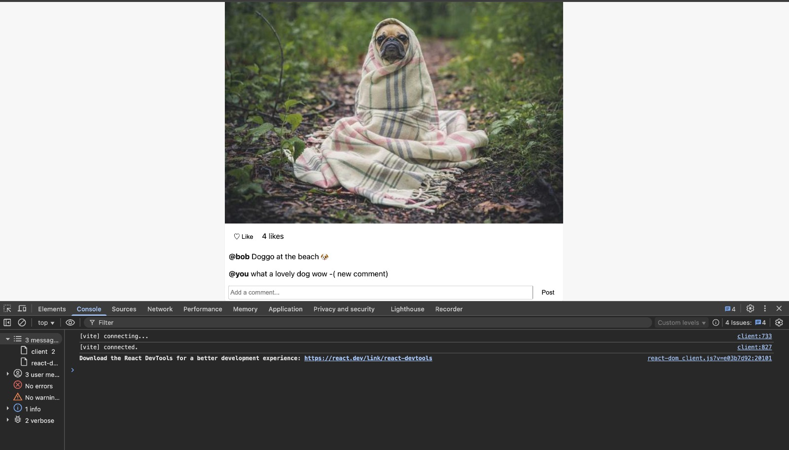
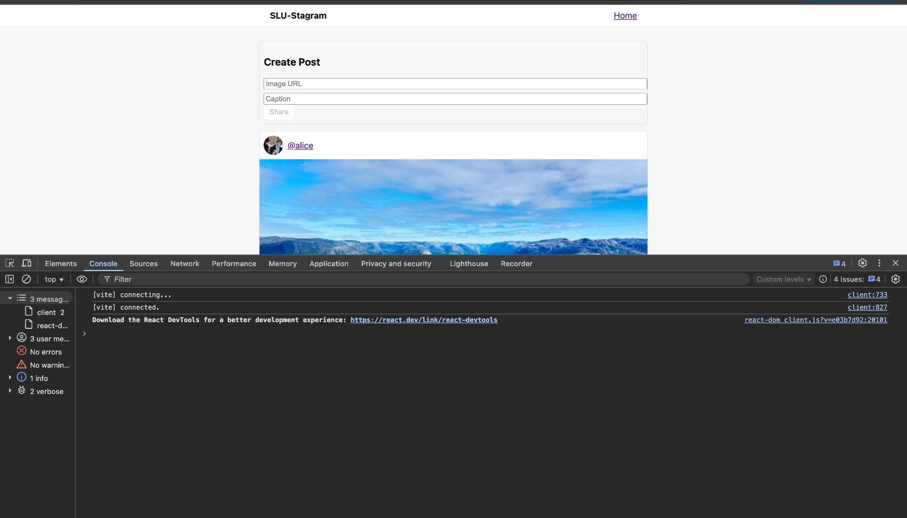

## Live Demo

[SLU-stagram](https://slu-stagram.vercel.app/)
📋 Grader Report:

This section documents screenshots and code references required for assessment.

# Screenshot A – Two Posts (Liked and Not Liked)

Instructions:

1.Start the app (npm run dev).

2.Make sure your feed shows at least two posts.

3.Click the ❤️ Like button on one post so it becomes filled and the like count increases.

4.Leave the second post unliked (♡).

Screenshot: Two posts — one liked, one not — with no console errors.
liked screenshot post:

Not liked screenshot post:

Screenshot with no console error:

---

# Screenshot B – Post with a New Comment

Instructions:

In the feed, add a new comment (e.g., “Great photo!”) under any post using the comment form.

The comment should instantly appear below that post.

Screenshot : A post showing a new comment added via the comment form.

---

# Screenshot C – Console Open, No Errors

Instructions:

1.Open Developer Tools → Console tab.

2.Refresh the page.

3.Ensure there are no red error messages in the console.

Screenshot: Browser console open showing no errors or warnings after reload.

---

# Screenshot D - Profile

Instructions:

1. Click on profile name of user.
2. You will navigate to u/username.

Screenshot: Profile of user

---

# Component Tree and State Management

The main application structure is organized as follows:
App
├─ Navbar
├─ Routes
├─ "/" Home
│ ├─ Composer
│ └─ Feed
│ └─ PostCard
│ ├─ CommentList
│ └─ CommentForm
└─ "/u/:handle" (Profile)
└─ Feed (filtered by user)
└─ PostCard

App -> contains Navbar and page Routes.
On the home page (/), App renders Composer (to add posts) and Feed, which contains multiple PostCard components.
Each PostCard has CommentList and CommentForm for displaying and adding comments.
The Profile page (/u/:handle) reuses Feed to show posts by a specific user.

# Where State Lives

The main state (posts) lives in App.jsx.

It is initialized from localStorage (for persistence) and updated whenever posts change.

The setPosts function is passed down as props to components like Composer, Feed, PostCard, and CommentForm, allowing them to:

Add new posts (Composer)

Toggle likes (PostCard)

Add comments (CommentForm)

The Profile page filters posts by author but still relies on the same posts state.

This single-source-of-truth structure keeps data consistent across all pages and components.
